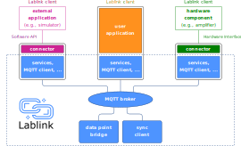

*****************************************
Welcome to the AIT Lablink documentation!
*****************************************

.. meta::
   :description lang=en: AIT Lablink laboratory middleware

The **AIT Lablink** aims at supporting an efficient, modular and flexible development and evaluation environment, which focuses on laboratory hardware and software equipment.
Its main goal is to support and automate common tasks such as coupling components, logging results and automating test cases.

A common middleware that handles communication among distributed clients comprises the core of the AIT Lablink. 
This middleware is called **Lablink Core** and provides data routing and and encoding facilities. 
Lablink Core is designed as a distributed application, implemented in a dedicated library, whose interfaces expose the functionality of Lablink.

The Lablink Core infrastructure provides the basis to implement dedicated **Lablink clients**, enabling access to common components such as laboratory hardware or domain-specific simulation tools.
In addition, utility tools for synchronizing clients or recording data can be implemented on top of the Lablink Core.

Getting started
===============

:doc:`Lablink in a Nutshell <lablink_in_a_nutshell>` gives a brief overview of the main concepts of the AIT Lablink.

To get your fingers dirty and run a few simple Lablink setups, you can go through the `Lablink examples <https://ait-lablink.readthedocs.io/projects/ait-lablink-examples>`_.

.. toctree::
   :maxdepth: 2
   :hidden:
   :caption: Getting started

   /lablink_in_a_nutshell

The Lablink framework
=====================

The AIT Lablink is a modular framework that comes with a collection of readily available clients.
For more information, please take a look :doc:`here <framework>`.

.. toctree::
   :maxdepth: 2
   :hidden:
   :caption: The Lablink framework

   /framework
