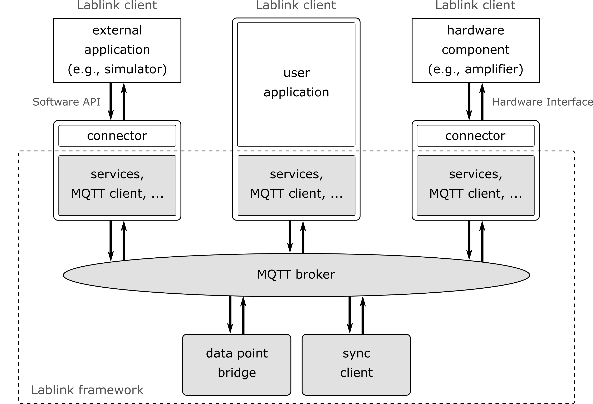
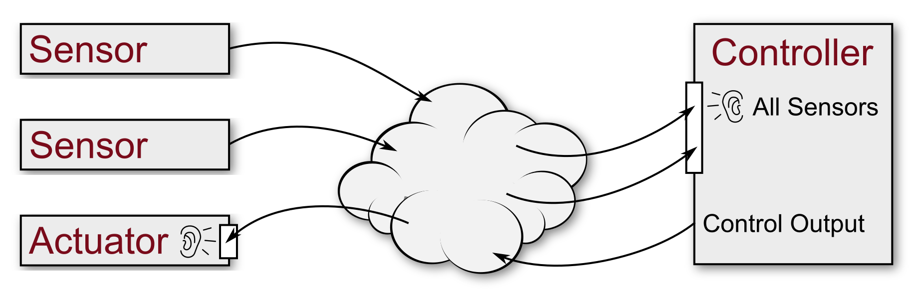
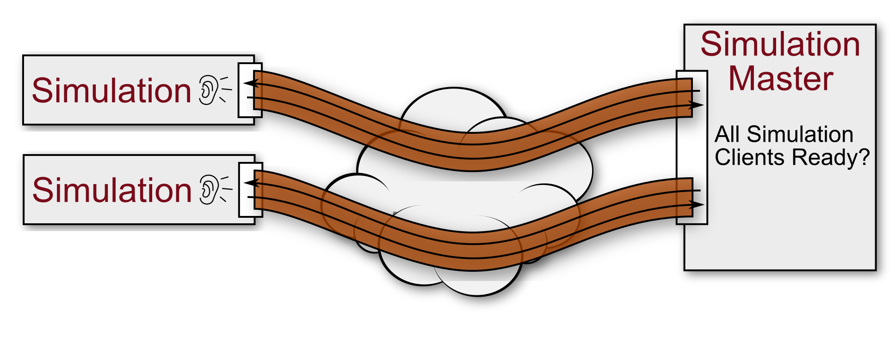

*********************
Lablink in a Nutshell
*********************

The Lablink infrastructure is designed to loosely couple various components in the laboratory environment.
Basically it is a communication protocol especially designed for the requirements in a Co- or Hardware-in-the-loop simulation system in a modern laboratory.

Lablink Core
============

The core component of Lablink provides a communication system based on MQTT as a transport protocol, with asynchronous messaging and syncronous remote procedure calls.
On top of this, the Lablink core implements services for clients (see below).

The Lablink core is (currently) implemented as a Java library.
The source code is available online in the `Lablink Core code repository <https://github.com/AIT-Lablink/lablink-core-java>`__, the corresponding packages are available as JAR files via the dedicated `remote Maven repository <https://github.com/orgs/AIT-Lablink/packages>`__.

Lablink System Architecture
===========================

Lablink Clients
===============

A Lablink client is a self executing process that will have a **single** connection to the Lablink system. A client can have different purposes.
It can be a connector to an external simulator that allows the data exchange between other Lablink clients and the simulator (e.g., Digsilent PowerFactory). 
A Lablink client can also be connector to a hardware device within the laboratory using defined communication standards (e.g., Modbus TCP or a serial interface). 
The third possibility is a Lablink client that implements itself the logic and the Lablink connection in one software process.

MQTT Broker
===========

Lablink is based on MQTT as low level communication.
Therefore, for using Lablink an MQTT broker is required that will distribute the messages between different Lablink clients.

The usage of MQTT provides some common functionalities that can be used with the Lablink. 
An example of such a functionality is the usage of secured connections.
MQTT provides a configurable SSL secured connection between a client and the broker.
Another example can be the load distribution of the MQTT broker.
In the open-source world there are MQTT brokers available that implement this feature.

Lablink Connection
==================

The Lablink connection is part of the core library.
The connection is an application interface that provides the access to the Lablink system.
Every Lablink client uses a single Lablink connection.
The Lablink connection provides an interface and allows the sending of messages and remote procedure calls through MQTT to other Lablink clients.

Address scheme
==============

Each Lablink connection must have an unique identifier that will be used within the Lablink system.
With this unique identifier the Lablink client can be addressed by other clients.
The identifier consists of three parts represented as strings:

* **Application Identifier**: 
  The application identifier will be unique within a Lablink application. 
  Only clients with the same application identifier can talk to each other.
  This identifier is necessary to allow different applications to run in parallel on a single broker.
  A common problem during the implementation of such an application is that to clients have different application identifiers and they won't see each other.

* **Client Group**: 
  Every client is member of a group. 
  A group can be addressed at once within the Lablink system. 
  So it is possible to receive a message from all clients within a defined group.

* **Client Identifier**:
  Every client has its on identifier.
  The combination of the group and client identifiers makes the addressing of the client unique.
  A single client can be addressed by using the group and client identifier.

Communication paradigms
=======================

The messaging components specially focus on the aspect of data exchange. 
Transferred data is encapsulated into transmission units of finite length which are called messages. 
Two different transmission schemes are supported. 
The uni-directional transmission scheme is called **Message-scheme** and the bi-directional scheme is called **RPC-scheme**.

Message-Scheme
--------------

The Message-scheme is used to publish data without specifying a particular destination.
The data source labels the published data with a statically defined identifier.
A subscribing data sink allows the user to configure the received data by specifying a set of identifiers.
Hence, the data source does not need to specify the destination and may be implemented efficiently.
Following the Message-scheme, only a uni-directional communication link is established.

For instance, a sensor may act as a data source and publishes data as soon as new readings are available.
The name of the published data point is statically defined. 
A controller is configured as a data sink which subscribes to a particular set of sensors. 
As soon as new data readings are available, the controller processes its input and publishes the result. 
An actuator may be configured as a data sink and may listen to any outputs from a particular controller. 
In the above example only uni-directional communication is required.
Hence, loose coupling can be handled efficiently by the Message-scheme.

RPC-Scheme
----------

The RPC-Scheme is used to establish a bidirectional communication on top of a `publish/subscribe-based <https://en.wikipedia.org/wiki/Publish%E2%80%93subscribe_pattern>`__ transmission.
It allows a single client to address a set of servers, which will be able to respond to that client. 
The first message from the clients to the servers is called request, the set of return messages replies.
The RPC-scheme allows to correlate received reply messages with their requests.

In contrast to the Message-scheme, the destination of a request will be configured at the sender.
The RPC server statically registers an end point and the client reads a user defined configuration to determine the destination addresses. 
The request sink may be used to provide functionality (e.g., a remote procedure) without defining the clients which use it. 
In order to receive a reply, the requester may dynamically register the return channel before sending the request. 
After all requests are received, the channel is unregistered. 
Alternatively, it may statically register the return channel to avoid frequent registration overhead.

A simulation master may utilize the transition scheme by acting as a RPC requester.
Each simulation client registers a RPC request end point. 
The simulation master may request the current status of each client by sending an RPC request. 
The clients reply a status message. 
The simulation master continues as soon as all response messages have arrived. 
Since each response is correlated to the initial request, a bi-directional channel is established.

Subject
-------

Every message and RPC call has a subject.
This subject will be used to identify the meaning of the message or call.

Message Subscription
--------------------

A client can register a subscription to a subject. 
If the messaging is used than the subscription can use wildcards for filtering only specific parts of a message subject.

RPC Destination
---------------

The RPC Destination defines the receivers of a remote procedure call. 
There are three possibilities to define the receivers.

An RPC call can be send to:
* all clients within the application (same application identifier)
* to all clients of a specific group (same group identifier)
* to a specific client (group and client identifier)

Services
========

A service within the Lablink system is a container for higher-level functionalities.
A service combines different messages and remote procedure calls between different clients to provide a higher-level function.
This service hides the complexity of the Lablink communication and provides a simple interface to the client for a specific task.

Currently the Lablink core implements two services:

* **DataPoint Service**:
  The datapoint service allows the exchange of simple values between Lablink clients.
  The datapoint server provides the exchange of these values using simple get and set methods.
  It also provides state information to the client, like the detection of an established connection between the clients or the notification of changed or received new values from a remote client.
  The `datapoint bridge <https://ait-lablink.readthedocs.io/projects/ait-lablink-core-java>`_ is a standalone Lablink client that implements and uses this service.

* **Sync Service**: 
  The sync service provides the time synchronization between the Lablink clients.
  This service will be used if the Lablink works as a Co- or HIL-Simulation framework.
  The `synchronization host <https://ait-lablink.readthedocs.io/projects/ait-lablink-sync-host>`__ is a standalone Lablink client that uses and implements this service.

Lablink Application Interface Concepts
======================================

The Lablink core is implemented in a multi-threaded way. 
Every incoming message will use its own thread for execution. 
This allows the parallel execution of the receiving task.

A client can register a callback method to react on an incoming message. 
This callback method will be called from the Lablink core in different threads.
Therefore a synchronization of the callback methods can be necessary.

All methods of the Lablink core that a client calls will be executed synchronously. 
This means that the method can be blocked by the core.
